# CO₂ Emissions App — Performance Report

## Test setup

- Build: Dev
- Dataset: example.json (~100MB)
- Actions profiled:
  1. Select region (Africa)
  2. Expand country card (Africa)
  3. Change year (2011)
  4. Sort by name
  5. Open “+Columns” modal
  6. Select one column
  7. Close modal with “Done”

---

## Scenario 1: Select Region (Africa)

| Metric            | Before                                                         | After                                    |
| ----------------- | -------------------------------------------------------------- | ---------------------------------------- |
| Commit Duration   | 2s                                                             | 3.4s                                     |
| Render Duration   | 90.1ms                                                         | 36ms                                     |
| Longest Component | App (58.9ms)                                                   | YearSelector (25.3ms)                    |
| Interactions      | RegionSelector → state(regionFilter) changed → App re-rendered | Same, but only small components rendered |

**Flame Graph:**  
Before 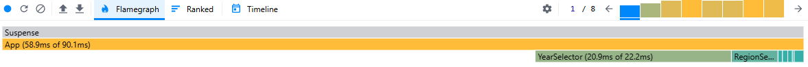  
After 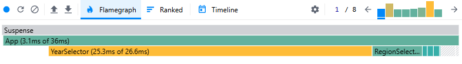

**Ranked Chart:**  
Before: Unfortunately I accidentally remove this file  
After 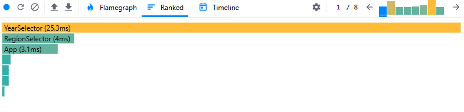

---

## Scenario 2: Expand CountryCard (Africa)

| Metric            | Before                                             | After                                                       |
| ----------------- | -------------------------------------------------- | ----------------------------------------------------------- |
| Commit Duration   | 3s                                                 | 4.7s                                                        |
| Render Duration   | 138.2ms                                            | 162.1                                                       |
| Longest Component | DataTable (123.9ms)                                | DataTable2 (Memo) (148ms)                                   |
| Interactions      | Click on CountryCard “Africa” → DataTable rendered | Click on CountryCard2 “Africa” → DataTable2 (Memo) rendered |

**Flame Graph:**  
Before
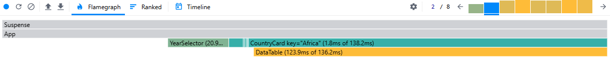  
After
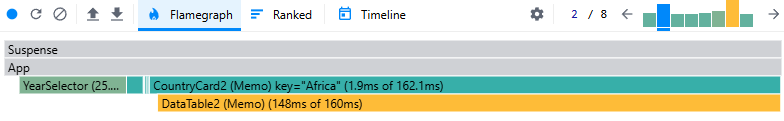

**Ranked Chart:**  
Before
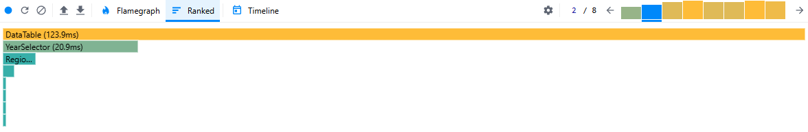  
After
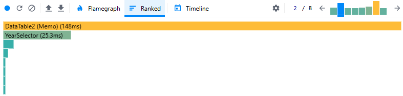

---

## Scenario 3: Change Year (2011)

| Metric            | Before                                                                | After                                          |
| ----------------- | --------------------------------------------------------------------- | ---------------------------------------------- |
| Commit Duration   | 4.6s                                                                  | 7.2s                                           |
| Render Duration   | 229.9ms                                                               | 29.7ms                                         |
| Longest Component | DataTable (138ms)                                                     | YearSelector (22.1ms)                          |
| Interactions      | YearSelector → state(selectedYear) changed → App + tables re-rendered | YearSelector → only selector + header rerender |

**Flame Graph:**  
Before
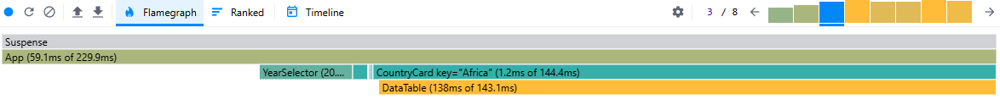  
After
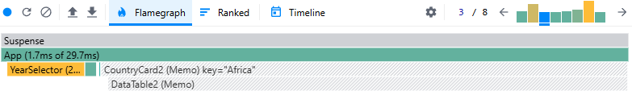

**Ranked Chart:**  
Before
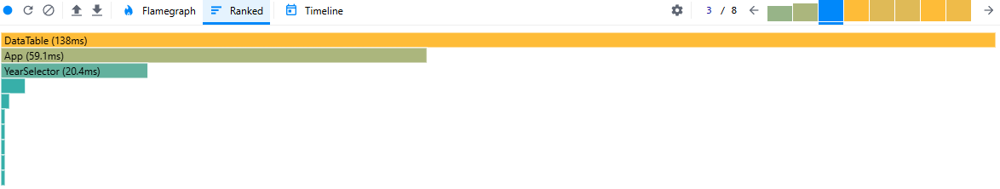  
After
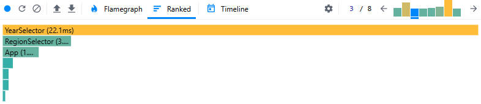

---

## Scenario 4: Sort by Name

| Metric            | Before                                                          | After                                |
| ----------------- | --------------------------------------------------------------- | ------------------------------------ |
| Commit Duration   | 4.9s                                                            | 7.3s                                 |
| Render Duration   | 280.3ms                                                         | 31.3ms                               |
| Longest Component | DataTable (163.3ms)                                             | YearSelector (21ms)                  |
| Interactions      | SortBy → state(sortKey=name) changed → App + tables re-rendered | SortBy → minimal components rerender |

**Flame Graph:**  
Before
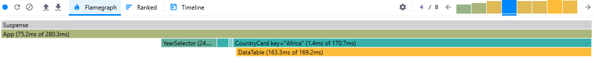  
After
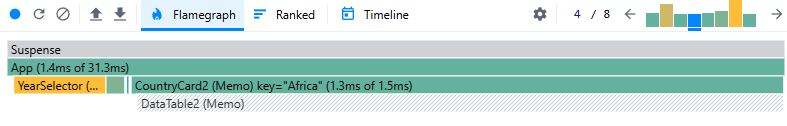

**Ranked Chart:**  
Before
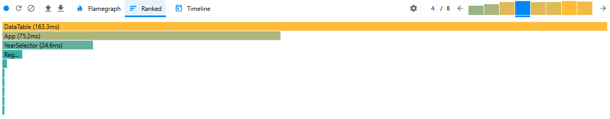  
After
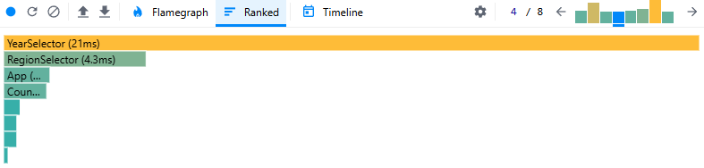

---

## Scenario 5: Open “+Columns” Modal

| Metric            | Before                                            | After                                        |
| ----------------- | ------------------------------------------------- | -------------------------------------------- |
| Commit Duration   | 6.6s                                              | 9.3s                                         |
| Render Duration   | 219.9ms                                           | 32.5ms                                       |
| Longest Component | DataTable (129.7ms)                               | YearSelector (24.7ms)                        |
| Interactions      | Click “+Columns” → modal opened → App re-rendered | Click “+Columns” → lightweight rerender only |

**Flame Graph:**  
Before
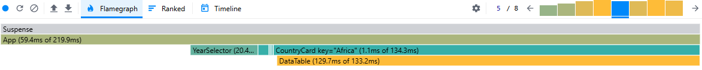  
After
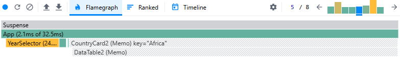

**Ranked Chart:**  
Before
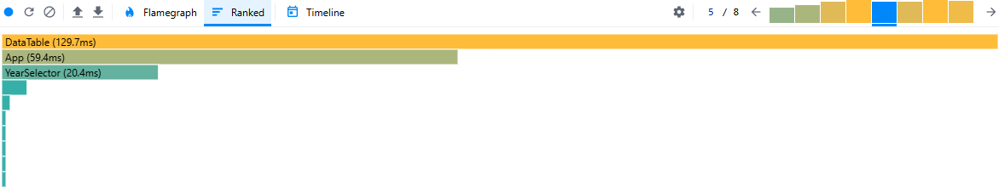  
After
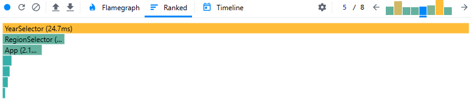

---

## Scenario 6: Select Column

| Metric            | Before                                                                | After                                           |
| ----------------- | --------------------------------------------------------------------- | ----------------------------------------------- |
| Commit Duration   | 7.9s                                                                  | 10.5s                                           |
| Render Duration   | 230.3ms                                                               | 50.2ms                                          |
| Longest Component | DataTable (122.7ms)                                                   | YearSelector (22.4ms)                           |
| Interactions      | Checked one column → state(selectedCols) changed → tables re-rendered | Checked one column → memoized, smaller rerender |

**Flame Graph:**  
Before
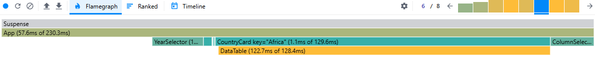  
After
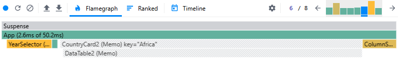

**Ranked Chart:**  
Before
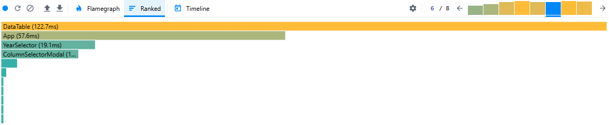  
After
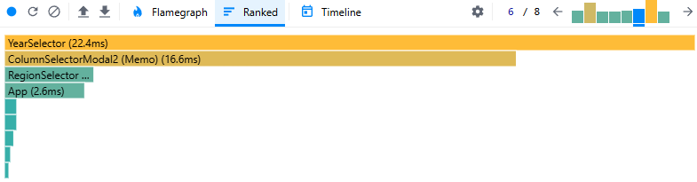

---

## Scenario 7: Close Modal (Done)

| Metric            | Before                                        | After                                               |
| ----------------- | --------------------------------------------- | --------------------------------------------------- |
| Commit Duration   | 10.5s                                         | 12.2s                                               |
| Render Duration   | 281.1ms                                       | 249.2ms                                             |
| Longest Component | DataTable (170.2ms)                           | DataTable2 (Memo) (189.9ms)                         |
| Interactions      | Click “Done” → modal closed → App re-rendered | Click “Done” → DataTable2 re-rendered (still heavy) |

**Flame Graph:**  
Before
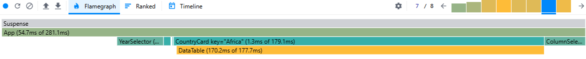  
After
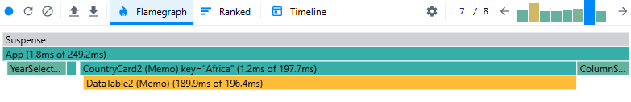

**Ranked Chart:**  
Before
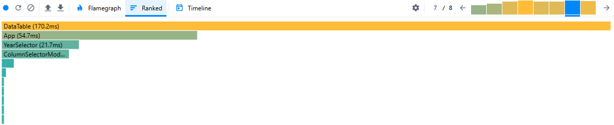  
After
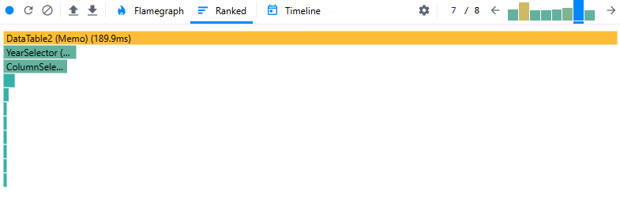

---

## Scenario 8: Extra Render (after Done)

| Metric            | Before                                                   | After                                       |
| ----------------- | -------------------------------------------------------- | ------------------------------------------- |
| Commit Duration   | 11.7s                                                    | 13.8s                                       |
| Render Duration   | 245.1ms                                                  | 26.2ms                                      |
| Longest Component | DataTable (159.7ms)                                      | YearSelector (19.6ms)                       |
| Interactions      | Modal closed, state persisted, triggered full App update | Modal closed → mostly YearSelector rerender |

**Flame Graph:**  
Before
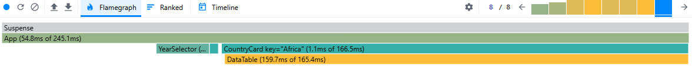  
After
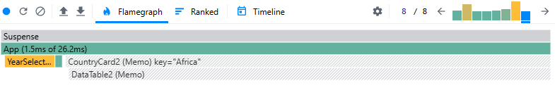

**Ranked Chart:**  
Before
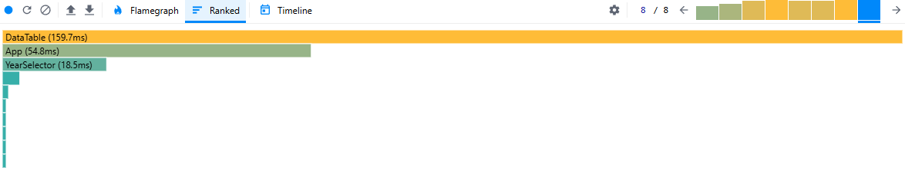  
After
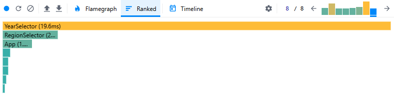

---

## Summary

- **Render Duration:** The critical metric improved substantially. Most interactions dropped from ~200–280 ms renders (before) to ~25–50 ms renders (after).
- **DataTable:** Still the heaviest component when a table is expanded. However, thanks to `React.memo`, it only re-renders when its `rows` or `extraColumns` actually change.
- **App:** Previously, every interaction triggered a full re-render of `App` and all children. After optimizations with `useMemo` and `useCallback`, only the components affected by the interaction update.
- **Flame Graphs:** Before optimization, deep trees of `CountryCard`/`DataTable` re-rendered frequently. After optimization, re-render paths are much shallower.
- **Ranked Charts:** `App` and `DataTable` dominated the render cost before. After optimization, lighter components like `YearSelector` show up as the main render contributors, with far lower render times.

**Conclusion:**  
Applying `React.memo`, `useMemo`, and `useCallback` significantly reduced unnecessary renders and improved rendering performance across interactions.
